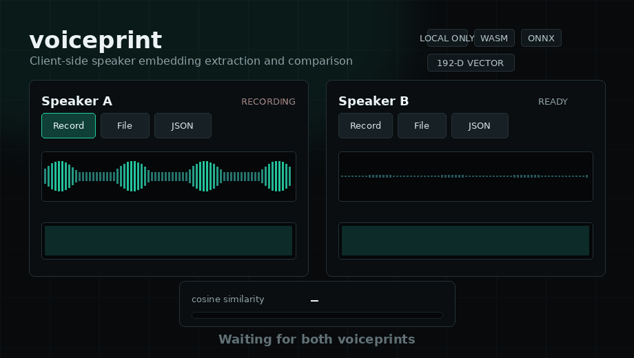

# voiceprint

[](https://www.npmjs.com/package/voiceprint)
[](https://opensource.org/licenses/MIT)
[](https://github.com/naohidden/voiceprint)

**Rust/WASM + ONNX Runtime Web** による、完全クライアントサイドの声紋抽出・比較 SDK。

サーバーに音声を送らず、**ブラウザ上だけで** 録音・前処理・speaker embedding 抽出・cosine similarity 比較まで実行します。

**[Live Demo](https://naohidden.github.io/voiceprint/docs/)**



## Features

- **ブラウザ完結** — 音声データ・声紋データを外部サーバーへ送信しません
- **Rust/WASM 前処理** — リサンプリング、音量正規化、VAD、kaldi 互換 fbank を高速実行
- **ONNX Runtime Web 推論** — 3D-Speaker 由来モデルから 192 次元の speaker embedding を抽出
- **モデル 3 段階** — small / base / large を用途とロード時間に合わせて選択
- **比較 API** — cosine similarity、しきい値判定、代表声紋のマージ、Top-K ランキング
- **可視化と品質情報** — スペクトログラム、ベクトルヒートマップ、発話時間、SNR、クリッピング警告
- **TypeScript** — 型定義付き。抽出結果は `ok: true | false` の判別可能 union

## Installation

```bash
npm install voiceprint
```

## Quick Start

```ts
import {
  extractVoiceprint,
  compareVoiceprints,
  isSameSpeaker,
} from "voiceprint";

const a = await extractVoiceprint(audioBlobA);
const b = await extractVoiceprint(audioBlobB, { model: "small" });

if (a.ok && b.ok) {
  const result = compareVoiceprints(a.voiceprint, b.voiceprint, {
    mode: "normal",
  });

  console.log(result.score); // cosine similarity
  console.log(result.sameSpeaker); // boolean
  console.log(result.confidence); // 'low' | 'medium' | 'high'

  if (isSameSpeaker(a.voiceprint, b.voiceprint)) {
    console.log("same speaker likely");
  }
} else {
  console.error(a.ok ? b : a);
}
```

`Blob` / `ArrayBuffer` / `Float32Array` を入力できます。WASM とモデルは初回呼び出し時に自動でロードされます。

## Models

[3D-Speaker](https://github.com/modelscope/3D-Speaker) (Apache-2.0) 由来の ONNX モデルを [Hugging Face Hub](https://huggingface.co/sollonao/voiceprint-models) から取得し、Cache Storage にキャッシュします。

| size    | Model            | Download | Dim | Use case                   |
| ------- | ---------------- | -------: | --: | -------------------------- |
| `small` | CAM++ zh/en int8 |   約 8MB | 192 | 最速ロード。デモや軽量用途 |
| `base`  | CAM++ zh/en      |  約 27MB | 192 | 既定。速度と精度のバランス |
| `large` | ERes2NetV2       |  約 69MB | 192 | 重いが頑健な比較           |

> 特徴量抽出 (fbank) は sherpa-onnx と **cosine = 1.0** で一致することを検証済みです。

## Extraction Options

```ts
const result = await extractVoiceprint(audio, {
  model: "base", // 'small' | 'base' | 'large'
  sampleRate: 16000, // Float32Array 入力時のサンプルレート
  minSpeechMs: 3000, // 必要最低発話時間。推奨 5〜10 秒
  vad: true, // 発話区間検出
  normalize: true, // 音量正規化
  returnSpectrogram: true, // 可視化データを含める
  modelBaseUrl: "...", // モデル配布先の上書き
});
```

失敗時は `ok: false` と `code` を返します。

| Code                  | Meaning                       |
| --------------------- | ----------------------------- |
| `NO_SPEECH_DETECTED`  | 発話が検出されなかった        |
| `SPEECH_TOO_SHORT`    | 発話時間が `minSpeechMs` 未満 |
| `AUDIO_DECODE_FAILED` | 音声デコードに失敗            |
| `MODEL_LOAD_FAILED`   | ONNX モデルのロードに失敗     |
| `INFERENCE_FAILED`    | 推論に失敗                    |
| `UNSUPPORTED_BROWSER` | Web Audio API などが利用不可  |

## Comparison API

```ts
import {
  compareVoiceprints,
  isSameSpeaker,
  mergeVoiceprints,
  rankVoiceprints,
  voiceprintToJson,
  voiceprintFromJson,
  voiceprintToHeatmap,
  preloadModel,
  THRESHOLDS,
} from "voiceprint";
```

| Function                                            | Description                                                             |
| --------------------------------------------------- | ----------------------------------------------------------------------- |
| `compareVoiceprints(a, b, options?)`                | 2 つの声紋を比較し、score / threshold / sameSpeaker / confidence を返す |
| `isSameSpeaker(a, b, options?)`                     | 同一話者判定だけを boolean で返す                                       |
| `mergeVoiceprints(list)`                            | 複数声紋を平均化し、登録用の代表声紋を作る                              |
| `rankVoiceprints(query, candidates)`                | 候補を similarity score の降順に並べる                                  |
| `voiceprintToJson(vp)` / `voiceprintFromJson(json)` | 保存・復元用にベクトルを JSON 化する                                    |
| `voiceprintToHeatmap(vp)`                           | ヒートマップ表示用の 2 次元配列に変換する                               |
| `preloadModel(size?)`                               | 初回抽出前にモデルを事前ロードする                                      |

## Thresholds

既定のしきい値は `loose: 0.35` / `normal: 0.45` / `strict: 0.55` です。

同梱モデルでは別話者スコアは概ね 0 付近、同一話者は 0.6〜0.8 に分布します。ただし、しきい値はモデル・録音環境・用途に依存します。実運用では手元のデータで調整してください。

```ts
compareVoiceprints(a, b, { threshold: 0.52 });
compareVoiceprints(a, b, { mode: "strict" });
```

## Privacy & Security

- SDK は音声・声紋データを保存しません
- ブラウザ内処理のため、利用者が送信しない限り音声は外部サーバーへ送られません
- voiceprint は個人識別に使える可能性があるため、保存時は個人情報として扱ってください
- 録音再生や合成音声による攻撃を受ける可能性があります。ログイン、決済、重要操作の単独認証には推奨しません

## Development

```bash
make up      # Docker コンテナ起動 (Rust + Node)
make build   # wasm-pack + tsc ビルド
make models  # ONNX モデル取得 + int8 量子化
make test    # Rust テスト + Node テスト
make demo    # http://localhost:8081/docs/
```

ローカルデモは `models/` を直接参照します。モデルを未取得の場合は `make models` を実行してください。

実モデルの推論テスト:

```bash
docker exec voiceprint node tests/inference.mjs [small|base|large]
```

### Model Release

生成した `models/*.onnx` を [Hugging Face Hub](https://huggingface.co/sollonao/voiceprint-models) にアップロードします。

```bash
make release-models   # 要 hf CLI: pip install huggingface_hub && hf auth login
```

Web UI からのドラッグ＆ドロップでも同じです。

> **GitHub Releases は使えません。** ダウンロード URL が `Access-Control-Allow-Origin` を持たない 302 を返し、リダイレクト先の `release-assets.githubusercontent.com` も同ヘッダを返さないため、ブラウザからの `fetch` は CORS で必ず失敗します。配布先を変更する場合は、実際にブラウザから取得できるか確認してください。

## Architecture

```text
Audio (Blob / ArrayBuffer / Float32Array)
  -> decodeAudio (Web Audio API, 16kHz mono)
  -> Rust/WASM preprocess (resample / normalize / VAD / fbank)
  -> ONNX Runtime Web
  -> L2 normalized speaker embedding
  -> compare / merge / rank / visualize
```

## License

MIT (SDK 本体)。

モデルは [3D-Speaker](https://github.com/modelscope/3D-Speaker) 由来 (Apache-2.0)、配布物は [sherpa-onnx](https://github.com/k2-fsa/sherpa-onnx) の変換済み ONNX を基にしています。
